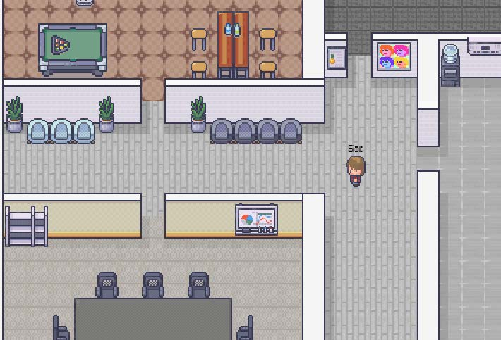
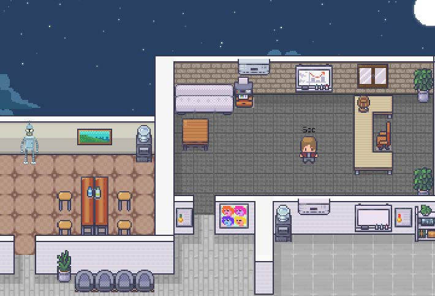
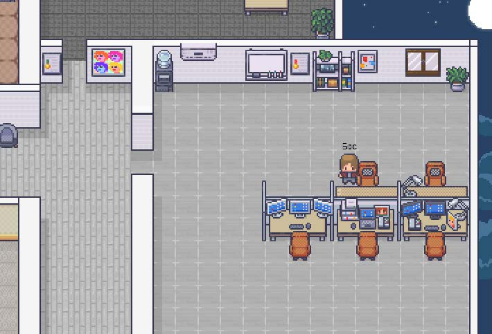

# 🎮 MyOfficeGame

**Мультиплеерный виртуальный офис в браузере**

Работай и общайся в 2D пространстве вместе с командой. Видеосвязь, доски, файлы — всё в одном месте.

---

## 📋 Описание

**MyOfficeGame** — это виртуальное пространство где команда может общаться и работать в игровом формате. Никакой установки, просто открой браузер и начни работать вместе с коллегами!

### ✨ Ключевые особенности

- 📡 **Proximity видеосвязь** — видеозвонок запускается автоматически когда персонажи подходят друг к другу
- 🖥️ **Шаринг экрана** — поделись экраном с теми, кто рядом
- ✏️ **Интерактивные доски** — рисуй на досках Excalidraw, все изменения сохраняются
- 💬 **Текстовый чат** — сообщения появляются над персонажами и в общем чате
- 🎒 **Система файлов** — загружай файлы, клади на карту, позволяй другим подбирать
- 🔒 **Приватные комнаты** — создавай комнаты с паролем для своей команды

---

## 🚀 Быстрый старт

### 1️⃣ Выбери аватара
Выбери персонажа и введи своё имя. Четыре персонажа на выбор.

### 2️⃣ Войди в лобби
Подключись к публичному лобби или создай приватную комнату для команды.

### 3️⃣ Начни работать
Ходи по офису, общайся, рисуй на досках, делись экраном и файлами.

---

## 🎯 Управление

| Клавиша | Действие |
|---------|----------|
| **W A S D** | Передвижение |
| **R** | Взаимодействие с объектом |
| **E** | Сесть / встать со стула |
| **Enter** | Открыть чат |
| **ESC** | Закрыть чат |
| **🎒** | Открыть инвентарь |

> 💡 На мобильном устройстве доступен виртуальный джойстик

---

## 📸 Скриншоты

  

---

## 🛠️ Технологии

- **Frontend:** HTML5, CSS3, JavaScript
- **WebRTC:** Для видеосвязи и screen sharing
- **Phaser 3:** Игровой движок
- **Excalidraw:** Интерактивные доски
- **Socket.io:** Реалтайм коммуникация

---

## 🤝 Использование

### Для команд
- Виртуальные стендапы и встречи
- Совместная работа над проектами
- Неформальное общение в рабочее время
- Онбординг новых сотрудников

### Для мероприятий
- Виртуальные конференции
- Нетворкинг события
- Образовательные воркшопы
- Выставки и презентации

---

## 💝 Поддержать проект

Если вам нравится MyOfficeGame и вы хотите помочь его развитию — мы будем искренне благодарны за любую поддержку. Это помогает нам улучшать проект и добавлять новые функции.

---

## 📄 Лицензия

Основан на [SkyOffice](https://github.com/kevinshen56714/SkyOffice) (ISC License)

---

## 📧 Контакты

**Связаться с разработчиком:** [jaisonwilson@yandex.ru](mailto:jaisonwilson@yandex.ru)

---

**Сделано с ❤️ для удалённых команд**

[🎮 Играть](https://myofficegame.duckdns.org) • [🌐 Сайт](https://rkosobokov.github.io/MyOfficeGame/) • [❤️ Поддержать](https://www.donationalerts.com/r/jaisonwilson)

