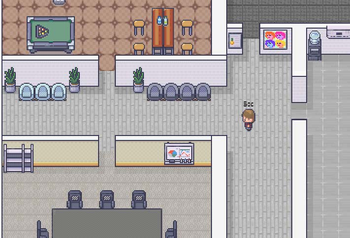
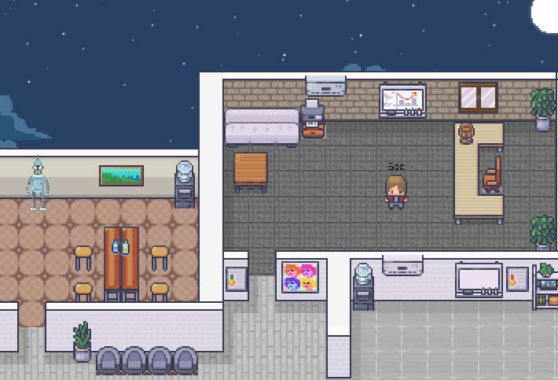
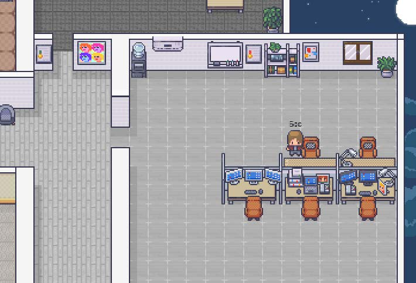

# 🎮 MyOfficeGame

**Мультиплеерный виртуальный офис в браузере**

Работай и общайся в 2D пространстве вместе с командой. Видеосвязь, доски, файлы — всё в одном месте.

---

## 📋 Описание

**MyOfficeGame** — это виртуальное пространство где команда может общаться и работать в игровом формате. Никакой установки, просто открой браузер и начни работать вместе с коллегами!

### ✨ Ключевые особенности

- 📡 **Proximity видеосвязь** — видеозвонок запускается автоматически когда персонажи подходят друг к другу
- 🖥️ **Шаринг экрана** — поделись экраном с теми, кто рядом
- ✏️ **Интерактивные доски** — рисуй на досках Excalidraw, все изменения сохраняются
- 💬 **Текстовый чат** — сообщения появляются над персонажами и в общем чате
- 🎒 **Система файлов** — загружай файлы, клади на карту, позволяй другим подбирать
- 🔒 **Приватные комнаты** — создавай комнаты с паролем для своей команды

---

## 🚀 Быстрый старт

### 1️⃣ Выбери аватара
Выбери персонажа и введи своё имя. Четыре персонажа на выбор.

### 2️⃣ Войди в лобби
Подключись к публичному лобби или создай приватную комнату для команды.

### 3️⃣ Начни работать
Ходи по офису, общайся, рисуй на досках, делись экраном и файлами.

---

## 🎯 Управление

| Клавиша | Действие |
|---------|----------|
| **W A S D** | Передвижение |
| **R** | Взаимодействие с объектом |
| **E** | Сесть / встать со стула |
| **Enter** | Открыть чат |
| **ESC** | Закрыть чат |
| **🎒** | Открыть инвентарь |

> 💡 На мобильном устройстве доступен виртуальный джойстик

---

## 📸 Скриншоты

  

---

## 🛠️ Технологии

- **Frontend:** HTML5, CSS3, JavaScript
- **WebRTC:** Для видеосвязи и screen sharing
- **Phaser 3:** Игровой движок
- **Excalidraw:** Интерактивные доски
- **Socket.io:** Реалтайм коммуникация

---

## 🤝 Использование

### Для команд
- Виртуальные стендапы и встречи
- Совместная работа над проектами
- Неформальное общение в рабочее время
- Онбординг новых сотрудников

### Для мероприятий
- Виртуальные конференции
- Нетворкинг события
- Образовательные воркшопы
- Выставки и презентации

---

## � Коммерческие услуги

Хотите уникальный виртуальный офис для вашей компании? Мы предлагаем индивидуальные решения!

### 🎨 Что мы можем для вас сделать:

<table>
<tr>
<td width="33%" align="center">
<h3>🏢 Брендированный офис</h3>

Создадим уникальный дизайн офиса в стиле вашей компании с логотипом, корпоративными цветами и персонализированными элементами

</td>
<td width="33%" align="center">
<h3>🔐 Приватный сервер</h3>

Развернём игру на вашем сервере или в корпоративной сети. Полный контроль, безопасность данных и независимость от внешних сервисов

</td>
<td width="33%" align="center">
<h3>⚡ Кастомные функции</h3>

Интеграция с вашими инструментами, добавление уникальных возможностей, API для корпоративных систем и многое другое

</td>
</tr>
</table>

### 💡 Дополнительные возможности:

- 🎯 **Интеграция с корпоративными системами** — подключение к Slack, Microsoft Teams, Jira, GitLab
- 📊 **Аналитика и отчётность** — статистика использования, активность сотрудников
- 🌍 **Мультиязычность** — адаптация интерфейса под ваш язык
- 👥 **Расширенное управление** — роли, права доступа, модерация
- 🎪 **Специальные зоны** — конференц-залы, зоны отдыха, выставочные пространства
- 🔧 **Техническая поддержка** — сопровождение, обновления, консультации

### 📞 Обсудить проект

Готовы создать идеальное рабочее пространство для вашей команды? Напишите нам!

---

## �💝 Поддержать проект

Если вам нравится MyOfficeGame и вы хотите помочь его развитию — мы будем искренне благодарны за любую поддержку. Это помогает нам улучшать проект и добавлять новые функции.

---

## 📧 Контакты

**Связаться с разработчиком:** [jaisonwilson@yandex.ru](mailto:jaisonwilson@yandex.ru)

---

**Сделано с ❤️ для удалённых команд**

[🎮 Играть](https://game.myofficegame.ru) • [🌐 Сайт](https://myofficegame.ru/) • [❤️ Поддержать](https://www.donationalerts.com/r/jaisonwilson)

